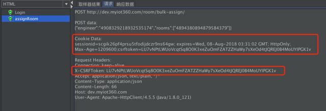

# Jmter 实现跨线程组共享cookie

## 场景：
  一个测试计划（Test Plan）下有多个线程组(Thread Group)，为了模拟真实的场景，要求只获取一次登陆接口`response headers`返回的`cookie`并且共享个其他的线程组，使其他线程组保持登陆状态。但是Jmter并没有直接提供这种方法，所以我们需要用全局变量来对`cookie`进行存取操作。

## 具体操作

现在我们创建线程组`Thread A`和`Thread B`，,`Thread A`用于发起登陆`login`的请求，`Thread B`则是模拟登陆之后的请求。我们首先需要在Test Plan下新增两个线程组（Thread Group），依次取名为Thread A和Thread B，然后再在Test Plan新增一个察看结果树（View Result Tree）类型的监听器（listener）方便我们检测是否共享`cookie成功`。测试计划大致目录如下。


- ### Thread A

  - #### 在Thread A下创建login请求，如下图

  

  - #### 配置login请求，如下图

  

  - #### 在login请求下创建正则表达式提取器（Regular Expression Extractor）
    添加方法如下图:

    

    下面开始进行具体的配置：

    

    注意红框部分，选择的是`Response Headers`。

    下面我们依次来看4个输入框内容。

    1. 代表你要给这个正则匹配到的值命名，如这个地方取的名字是`SESSIONID`

    2. 具体的正则匹配表达式

    3. `$1$`表示解析到的第1个值

    4. 0代表随机取值，1代表全部取值

    在这里，我们需要匹配的是`Response Headers`中`Set-Cookie`自段里面`sessionid`的值，`(.*)`代表匹配到的值，并且用一个名为`SESSIONID`的变量存储匹配到的值。

  - ####  在login请求下创建JSON Extractor

    部分操作的token验证携带在login返回的josn里，所以我们需要配置`JSON Extractor`来提取这一部分token。具体操作如下图。

    创建 JSON Extractor

    

    配置 JSON Extractor

    

    如上图所示，`csrftoken`是变量名，`$.data.csrftoken`则是取返回值data字段里csrftoken的值。

  - ####  在login请求下创建BeanShell PostProcessor
    通过上述操作，我们已经获得了两个值，分别为`SESSIONID`和`csrftoken`，那么我们需要把这两个变量变成全局变量，供其他线程组使用。
    创建 BeanShell PostProcessor

    

    配置 BeanShell PostProcessor

    

    通过上述配置，即两段代码：


    ``` java
    ${__setProperty(sessionid,${SESSIONID},)}
    ${__setProperty(csrftoken,${csrftoken},)}
    ```

    我们通过`__setProperty`方法设置了两个全局变量，分别为`sessionid`和`csrftoken`。在其他线程组中，我们可以通过`${__property(sessionid)}`和`${__property(csrftoken)}`来获取这两个全局变量的值。

    至此，我们对于登陆部分的cookie和token的全局配置处理就已经结束了，下面就是如何在其他线程组中去调用这两个变量。

- #### Thread B
  - 创建 HTTP信息头管理器

    

    配置如下：

    

    我们配置了`Cookie`字段，其值为`sessionid=${__property(sessionid)};csrftoken=${__property(csrftoken)}`。配置了`X-CSRFToken`其值为`${__property(csrftoken)}`
    在这里便是通过`__property`方法获取到之前定的变量值。
    至此，已经配置好了`Thread B`所需要的`Cookie`验证以及`X-CSRFToken`验证

  - #### 验证

    在`Thread B`下新建一个post方法的http请求，取名`assignRoom`,大概配置如下：

    

    然后点击运行，去查看结果树（View Result Tree）里看请求头是否带上了我们配置的参数：

    

    从红框部分我们可以发现，名为`assignRoom`的请求的信息头的确带上了`Cookie`和`X-CSRFToken`，请求也是成功的。
## 总结
​	吐槽一下，Jmeter文档实在是太少，绝大部分中文文档都是同一线程组下共享cookie，官方都直接出了个*Cookie 管理器*了，根本没必要大动干戈；而英文文档都是直接上命令行，也不告诉你这个命令代码要写在什么地方，实在是蛋疼。不过最后总算还是解决了，总的来说就是在登录所在的线程组中，配置一个后置处理器中的正则提取器和JSON提取器（不一定需要）抽出全局变量，然后再在其他地方调用这个全局变量。如果有更好的解决办法，欢迎指正。
